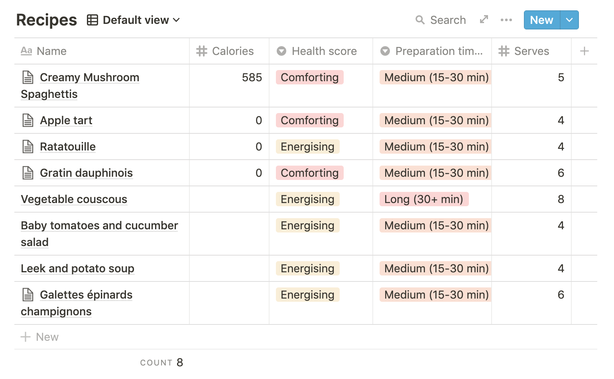

# notion-cms

Use [notion.so](https://www.notion.so/) as a headless CMS.

## Installation

Choose one:
- `yarn add @notion-cms/client @notion-cms/react`
- `npm install @notion-cms/client @notion-cms/react`

## Usage

### Setting up a Notion integration

As of v0.1.0 notion-cms uses the official [Notion API](https://developers.notion.com/) which enables us to cleanly read data from Notion, manage access permissions, etc.
To use the Notion API we need to create a Notion integration:

- Go to https://www.notion.so/my-integrations and create an integration for your project.
- If you're using Notion as a CMS typically read access will be enough (no need for insert or update capabilities). Adapt to your own needs.
- Copy the integration token.
- Share any page you need access to with the newly created integration.

### Setting up a collection

The easiest way to setup your CMS data on Notion is to use [collections](https://www.notion.so/Create-a-database-2529ab92d63b478f87d39c2289527444) (aka "databases"):


Use properties of any type to represent your data.

### Loading data

- The first thing you need to load your collection data is to instanciate a Notion client using the integration token from above:
  ```ts
  import Notion from "@notion-cms/client";
  export const notion = new Notion({ auth: process.env.NOTION_API_KEY });
  ```

- Then we will setup a Typescript interface to match our collection property:
  ```ts
  import Notion, {
    DatabaseProps,
    ParsedPage,
    ParsedPageWithBlocks,
  } from "@notion-cms/client";

  export type Duration =
    | "Short (0-15 min)"
    | "Medium (15-30 min)"
    | "Long (30+ min)";
  export type HealthLevel = "Indulging" | "Comforting" | "Energising";
  interface RecipeProps extends DatabaseProps {
    Name: string;
    "Health score": HealthLevel;
    "Preparation time (min)": Duration;
    "Cooking time (min)": Duration;
    Serves: number;
  }
  export interface Recipe extends ParsedPage<RecipeProps> {}
  export interface RecipeWithBlocks extends ParsedPageWithBlocks<RecipeProps> {}
  ```

  The [`ParsedPage`](./packages/client/lib/types.ts) generic interface wraps the collection properties (aka props, which extend `DatabaseProps`) as well as meta data (page cover and icon).
  The `ParsedPageWithBlocks` interface also contains page blocks.

- Then we're going to extract the UUID of the collection we wish to load. One way to find this UUID is to run the following script in the browser console:
  ```js
  document
    .querySelectorAll(
      ".notion-page-content > .notion-collection_view-block"
    )
    .forEach((collection) =>
      console.log(
        collection.querySelector("[spellcheck]").textContent,
        ":",
        collection.attributes["data-block-id"].nodeValue
      )
    );
  ```
  This will print the UUIDs of all the collections in the current page.

- Finally we can call the `notion.loadDatabase` method to load entries in a database (without blocks):
  ```ts
  const recipesCollectionId = "bc0e5612-c5a1-4e3d-9d63-13bac995e5a2";

  const getRecipes = (): Promise<Recipe[]> =>
    notion.loadDatabase(recipesCollectionId, {});
  ```
  Or the `notion.loadPage` method to load a single page (with blocks):
  ```ts
  const getRecipe = (recipeId: string): Promise<RecipeWithBlocks> =>
    notion.loadPage(recipeId);
  ```

### Rendering blocks

Once a Notion page has been loaded it can be easily rendered with `@notion-cms/react`:

```tsx
import { Blocks } from "@notion-cms/react";

const PageComponent = ({ page }) => (
  <div>
    <Blocks blocks={page.blocks} />
  </div>
);
```
